# Real Simple CAPTCHA Detection using Image Recognition 

**[Overview](#overview)**

**[Goals](#goals)**

**[Definitions](#definitions)**

> [CAPTCHA](#captcha)
>
> [Image Recognition](#image-recognition)

**[Dataset Description](#dataset-description)**

**[Methodology](#methodology)**

> [Dataset Generation](#dataset-generation)
>
> [Model Training](#model-training)
>
> [Prediction Workflow](#prediction-workflow)

**[Implementation](#implementation)**

> [Dataset Generation](#dataset-generation-1)
>
> [Deep Learning Model](#deep-learning-model)
>
> [Deep learning Model Parameters](#deep-learning-model-parameters)

[Results - Training](#results---training) 

> [Training Accuracy](#training-accuracy) 

**[Results - Final Prediction](#results---final-prediction) **

> [Dense layer
> parameters](#question-2-dense-layer-parameters) 
>
> [Normalized vs Non
> Normalised](#question-3-normalized-vs-non-normalised) 

# Overview

To construct a captcha detection algorithm by performing the image
recognition on individual images

# Goals

1.  Data Generation using given dataset

2.  Training the model on individual images

3.  Testing the model on real life captcha datset

# Definitions

## CAPTCHA

As a security measure, websites utilize CAPTCHA (Completely Automated
Public Turing Test to Tell Computers and Humans Apart) to distinguish
between human users and automated programmes, also referred to as bots.
The standard CAPTCHA challenge is one that is challenging for people to
complete yet simple for robots to solve. This difficulty may appear as
distorted characters or numbers, a task requiring the identification of
images, or as a straightforward query requiring human intellect to
resolve. The goal of CAPTCHA is to stop automated programmes from
obtaining private or valuable information, such user account
information, or from engaging in harmful behaviors, like spamming or
phishing.

Here We have used Really simple captcha from wordpress which used 32
characters Alphanumerical for prediction.

> **ABCDEFGHJKLMNPQRSTUVWXYZ23456789**

## Image Recognition

Computer vision has a section called image recognition that focuses on
how well computers can spot patterns and objects in digital pictures. To
automatically assess and categorize visual input, computer vision
methods and machine learning algorithms are used. In order for an
algorithm to learn to detect patterns and characteristics that are
shared by particular objects or categories, it must be trained on a
sizable dataset of labeled photos. These attributes might be unique to a
certain class of items\' forms, textures, colors, or other visual
traits.

Once trained, the programme can examine fresh, unlabeled photos and
predict the presence of any items or patterns.

# Dataset Description

The Given dataset consists of 1000's images of captchas which are taken
from the above source. They are named accordingly to the characters
present in the images so that it is easy for us to train the model based
on the labels

These are some of the sample images

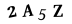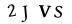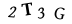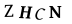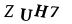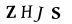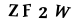

# Methodology

For performing the following tasks we can classify the tasks into the
following categories

-   Dataset generation

-   Model Training

-   Model Prediction

## Dataset Generation

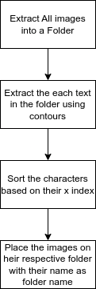

## Model Training

The process in model training are

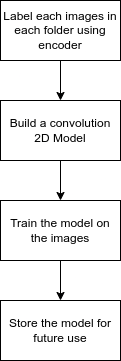

## Prediction Workflow

For predicting a captcha, we will perform

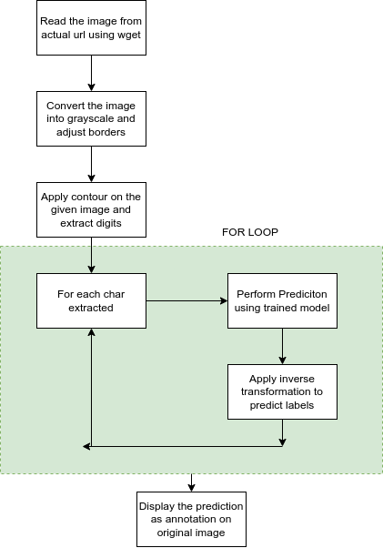

# Implementation 

## Dataset Generation 

As per the logic discussed in the methodology section, we had generated
all the images on the "extracted_letter_images" folder as displayed
below

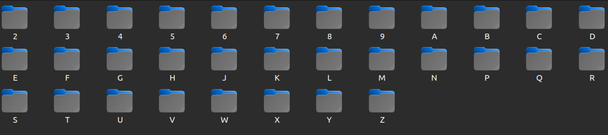

A total of approximately 40 thousand individual images were recovered to
corresponding classes.

## Deep Learning Model

The Deep learning model is generated using tensorflow keras using the
convolutional layers and max pooling layers followed by a dense layer at
the end for prediction

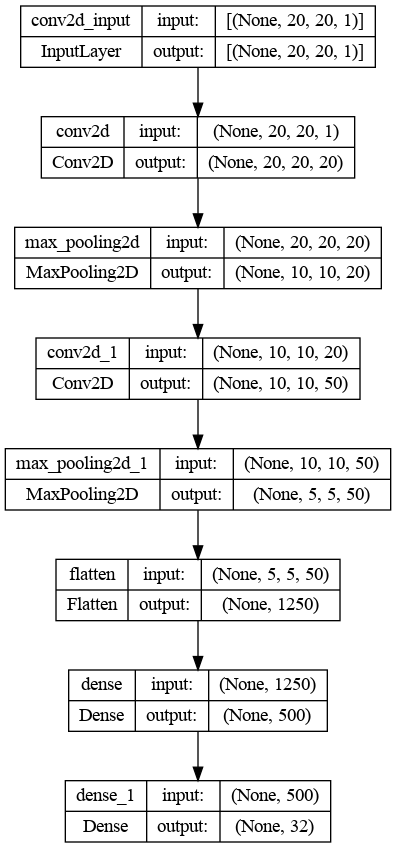

## 

## Deep learning Model Parameters

The number of trainable parameters in each of the model is mentioned
below

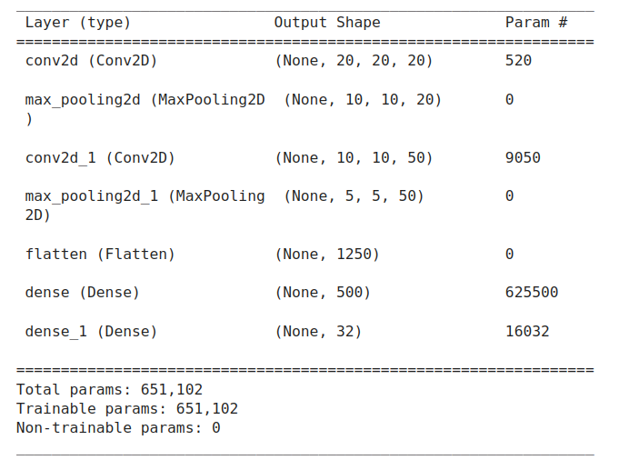

# Results - Training

## Training Accuracy 

The model was able to generate a training accuracy and validation
accuracy as given below

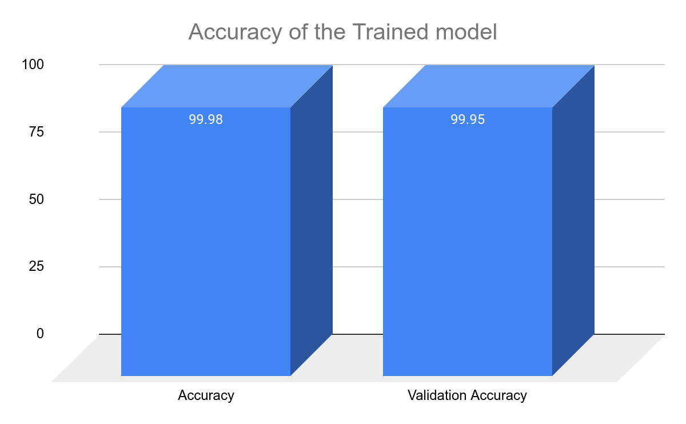

# Results - Final Prediction 

We made the prediction on this image

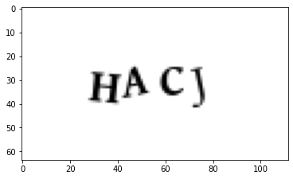

And the prediction obtained was

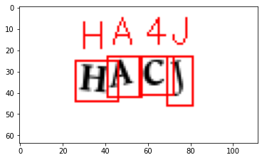

We were able to predict 3 out of 4 characters

# Questions

## Question - 1 Why \`conv2d_1\` has 9050 parameters? 

The formula for computation of number of parameters within conv2d layer
is given by

$param\_ number\ Conv\ 2d\  = \ output\_ channel\_ number\ *((input\_ channel\_ number\ *\ height\ *\ width)\  + \ 1)\ $

$Output\ Dimension\ Conv\ 2d\  = \ \frac{Input\ Dimension\  + 2*padding\  - \ kernel}{stride}\  + \ 1\ $

1st Layer \--\> Input 20 \* 20 \* 1 , kernel = 5, Filters =20

So output = 20 +2(0)- 5/(1) + 1 ==\> 16 , So output \*\*(16 \* 16 \*
20)\*\*

2nd Maxpool Layer \--\> Input 16 \* 16 \* 1 , kernel = 2, Stride=2,
Filters =20

So output = 20 +2(0) -2 /(2) + 1 ==\> 10 , So output \*\*(10 \* 10 \*
20)\*\*

Parameters in conv2d based on formula

((3\*3\*20) + 1) \* 50 ==\> **9050**

## Question 2: Dense layer parameters

Num param in dense layer = num Neuron in pre layer \* num neuron in
current layer (weights) + num_neuron in current layer(bias)

Params = 1250\*500 + 500 ==\> **625500**

## Question 3: Normalized vs Non Normalised

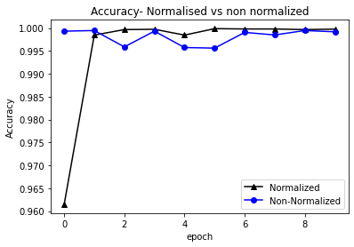

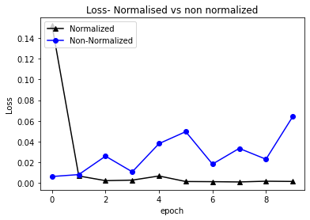

**Inference**

-   The Normalized model converges smoothly during epochs.

-   The non normalized model, does not converges smoothly and also it
    > converges at a slower rate than the normalised model.